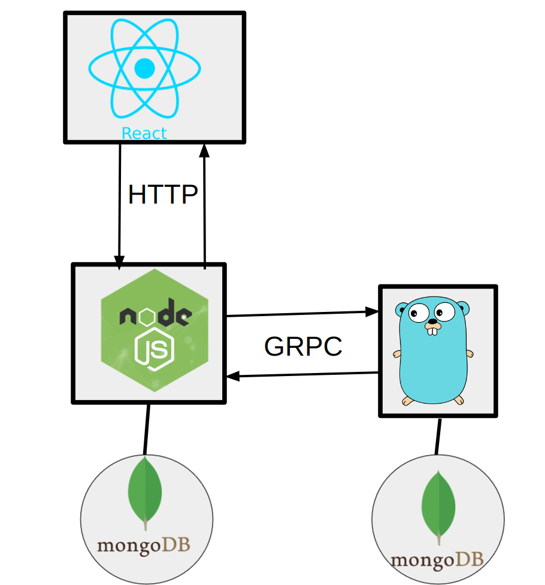
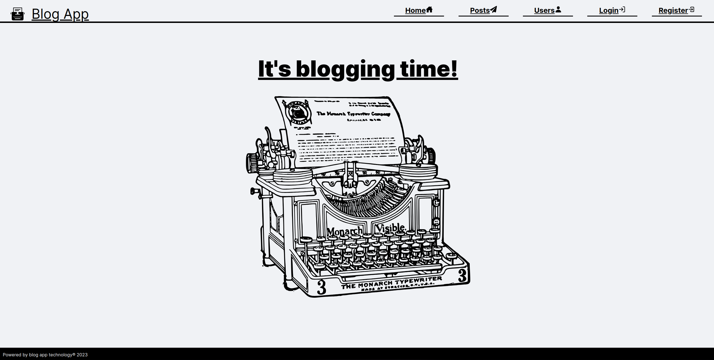
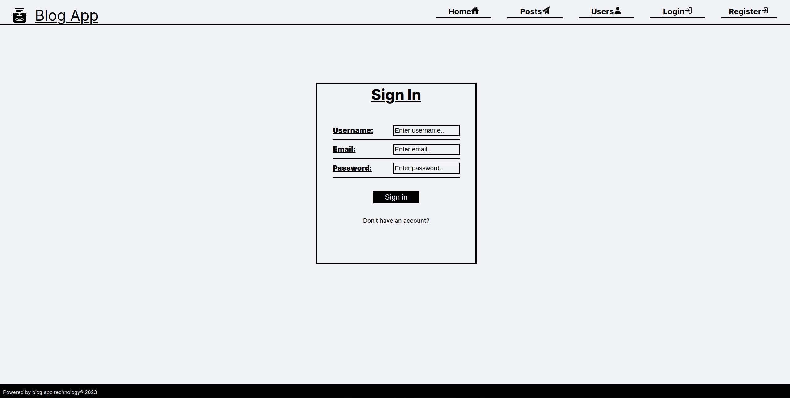
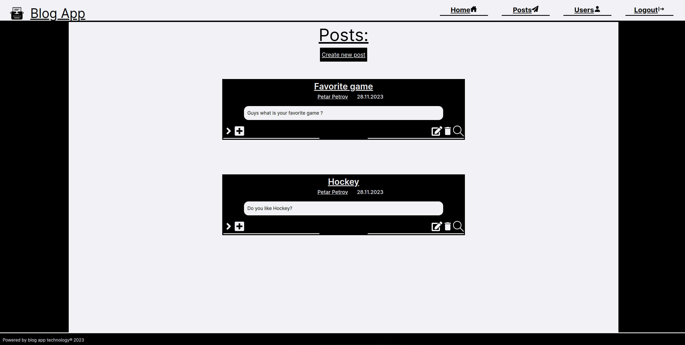
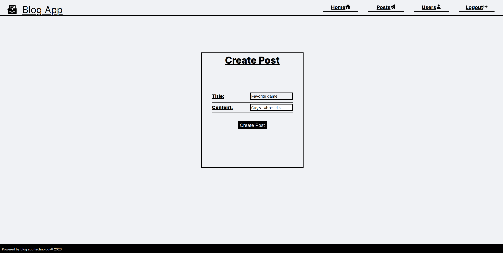
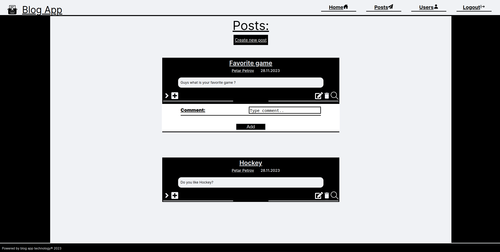
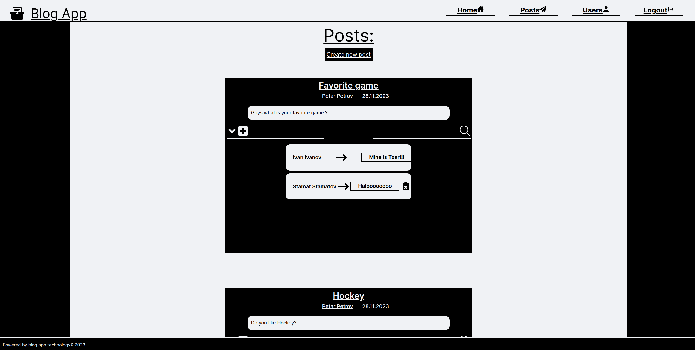

# Blog app

# Project Structure

## Backend API:
- **Tech Stack**: NodeJS/ExpressJS HTTP Server with a GRPC client
- **Data Storage**: MongoDB (Posts and Comments entities)

## Backend Authentication Service:
- **Tech Stack**: Golang GRPC Server for user authentication
- **Data Storage**: MongoDB (User entity)

## Frontend React Service:
- **Tech Stack**: React and TypeScript
- **Design**: Monochrome design

# How to Run

From the root folder:

- **Backend API**: `cd ./blog-app-api; npm start`
- **Backend Authentication Service**: `cd ./blog-app-auth-service; go run main.go`
- **Frontend React Service**: `cd ./blog-app-frontend; npm run dev`

# Flow

1. The user interacts with the frontend, making HTTP requests to the Backend API.
2. If a request is related to the User entity, the Backend API makes a GRPC call to the Backend Authentication Service.
3. If not, the Backend API responds to the Frontend React Service.
4. The Backend Authentication Service responds with a JWT token or with a User protobuffer message, which is forwarded by the Backend API to the Frontend React Service.

# Key Features

- JWT authentication
- Independent scalability for the Backend API and the Backend Authentication Service
- Responsive design

## Photos:

